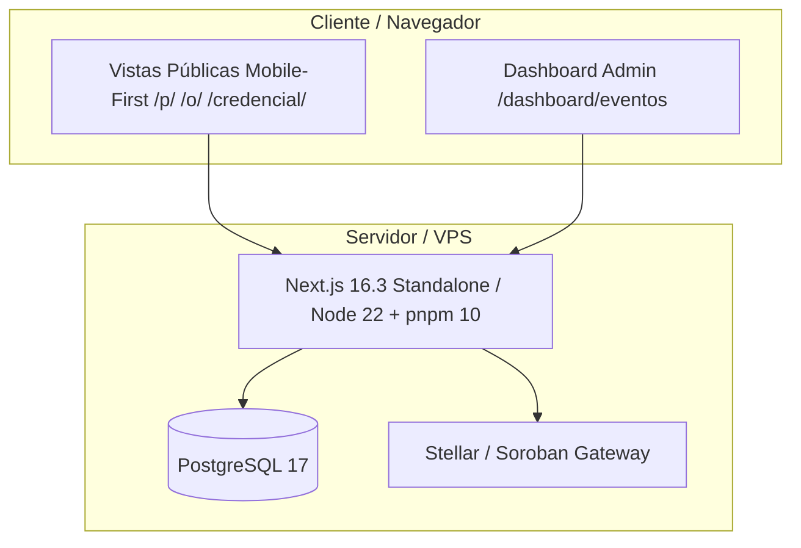

# Arquitectura del Sistema - CulturaGO

Este documento detalla la arquitectura técnica, el modelo de datos y las decisiones de diseño del proyecto **CulturaGO (FDVC 2026 MVP)**.

---

## 1. Visión General de la Arquitectura

---

## 2. Componentes Técnicos

### 2.1 Core Web Engine
* **Framework**: Next.js 16.3.3 (App Router) con React 19.
* **Empaquetado**: Modo `output: "standalone"` en Docker (Node 22), no-root `nextjs`.
* **Gestor de Paquetes**: `pnpm 10` vía Corepack.

### 2.2 Base de Datos y Persistencia
* **Producción**: PostgreSQL 17 conectado directamente vía `pg` y migraciones en `database/migrations/` (hasta `0011_rate_budget.sql`).
* **Desarrollo / Offline**: `InMemoryOperationStore`, `InMemoryIdentityStore` e `InMemoryRateBudgetStore` ofrecen fallback sin credenciales demo hardcodeadas.

### 2.3 Esquema Relacional de Base de Datos
* `entities`: entidades polimórficas base (person, organization, provider, event).
* `people`, `organizations`, `providers`, `events`: extensiones tipadas.
* `relationships`: vínculos entre entidades.
* `participations`: estados de participación en eventos.
* `credentials`: certificados digitales oficiales.
* `wallets`: direcciones Stellar y passkeys (sin custodia).
* `stellar_operations`: outbox durable de operaciones on-chain.
* `accounts`, `sessions`, `passkeys`: identidad y autenticación (Fase 8 / F1).

### 2.4 Capa Blockchain Stellar/Soroban
* **CanonicalHashService**: canonicalización JCS + SHA-256 con separación de dominio (`CULTURAGO\0<schema>\0<canonical-json>`).
* **SorobanStellarGateway**: máquina de estados para `prepare` → `awaiting_signature` → `signed` → `submitted` → `confirming` → `confirmed`, con readback ANTES de marcar confirmado.
* **StellarWorker**: consume `OperationStore.claimBatch` y maneja firma, reconciliación, TTL y observabilidad.
* **Perímetro (`src/infrastructure/perimeter/perimeter.ts`)**: rate/budget durables, origin allowlist, validación de cuerpo JSON.

---

## 3. Acceso y Administración de la Base de Datos

### Requisito principal
Una instancia PostgreSQL 17 y la variable `DATABASE_URL`.

### Métodos de Acceso:
1. **CLI**: `psql $DATABASE_URL` o `pnpm migrate`.
2. **Cliente SQL**: host, puerto, usuario y contraseña definidos en `DATABASE_URL`.
