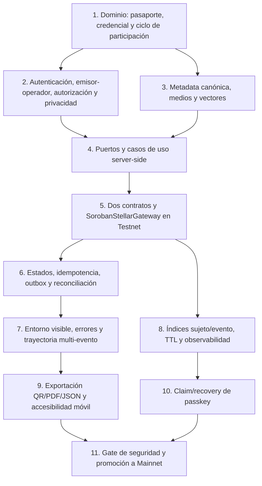

# Mejoras recomendadas

## Decisión y prioridades

CulturaGO es un MVP funcional de pasaportes y acreditaciones culturales, pero todavía opera con autenticación, datos y Stellar simulados (`README.md:1-13`, `docs/architecture.md:43-61`). La prioridad es impedir que una demo se interprete como producción verificable y construir una ruta segura a Testnet antes de Mainnet.

- **P0 — antes de producción:** controles cuya ausencia puede producir acceso no autorizado, afirmaciones falsas de verificación, pérdida/duplicación de operaciones o exposición de datos.
- **P1 — después de estabilizar P0:** resiliencia, recuperación, indexación, accesibilidad y operación sostenible.
- **P2 — opcional:** mejoras de calidad que no bloquean el primer despliegue controlado.

## P0 — antes de producción

| Mejora | Evidencia actual | Riesgo / beneficio | Acción mínima | Criterio de aceptación | Impacto UX |
|---|---|---|---|---|---|
| **Semántica Pasaporte vs. Credencial** | La vista llama “Pasaporte Cultural Oficial” a la entidad y lista credenciales filtradas (`src/app/p/[slug]/page.tsx:103-185`), pero la tarjeta mezcla sello/validez FDVC dentro del pasaporte estable (`src/components/PassportCard.tsx:136-160`). | Mezclar identidad agregada con una acreditación puntual favorece sobrescritura o transferencia conceptual incorrecta. Beneficio: trayectoria comprensible y estable. | Definir `Passport` como proyección estable por sujeto y `Credential` como atestación inmutable por evento/tipo; eliminar validez de un evento concreto del encabezado del pasaporte. | Evento A y Evento B aparecen como dos entradas; ninguna edición de pasaporte muta credenciales; pruebas de copy/modelo distinguen ambos conceptos. | La bailarina reconoce una identidad permanente y una línea de tiempo de logros independientes. |
| **Ciclo verificable de participación** | `participant_of` se crea directamente como `active` (`src/components/RelationshipManager.tsx:63-80`) y el formulario crea la credencial como `issued` sin prueba de asistencia (`src/components/CredentialForm.tsx:79-99`). | Una inscripción puede presentarse falsamente como participación confirmada. Beneficio: emisión respaldada por un hito auditable. | Modelar off-chain `registered -> checked_in -> participation_confirmed -> credential_issued` o equivalentes; cada evento define si el hito es check-in, asistencia o actuación confirmada y quién puede confirmarlo. | `participant_of` solo no habilita emisión; transiciones no autorizadas fallan; cada emisión de participación referencia una confirmación auditada y pruebas cubren omisiones/reintentos. | El organizador ve pendientes y confirma en un paso explícito; la bailarina no recibe evidencia prematura. |
| **`event_id` y `credential_type` on-chain** | Ambos campos existen off-chain (`src/lib/db.ts:120-137`, `docs/supabase-schema.sql:109-127`), pero el mock de emisión solo recibe ID, código, título y hash (`src/lib/stellar.ts:62-75`). | La cadena no puede demostrar a qué evento/tipo corresponde el hash ni aplicar idempotencia de negocio. Beneficio: evidencia autocontenida y verificable. | Incluir `event_id: BytesN<32>` y tipo acotado en registro, emisión, verificación y eventos; exigir evento registrado mediante orquestación de aplicación, sin llamadas entre contratos. | Readback devuelve evento/tipo; valor desconocido falla; evento inexistente/inactivo se rechaza antes de emitir; pruebas demuestran que Evento A/B generan registros distintos. | Verificación muestra evento/tipo respaldados por cadena y evita duplicados accidentales. |
| **Emisor institucional y operador autorizado** | El modelo distingue `issuer_entity_id`, pero el contrato anterior solo identificaba una `Address` y el formulario permite seleccionar organizaciones (`src/lib/db.ts:120-126`, `src/components/CredentialForm.tsx:119-125`). | Un operador global podría aparentar actuar por otra organización. Beneficio: atribución institucional comprobable y mínimo privilegio. | Guardar `issuer_id` y `issued_by`; exigir rol y vínculo on-chain `IssuerOperator(issuer_id, operator)` para emitir/revocar; administrar vínculos con eventos e idempotencia. | Tener rol sin vínculo falla; un operador vinculado a A no emite por B; readback muestra organización y firmante; revocación respeta el mismo ámbito. | La bailarina y el verificador ven quién emitió y qué operador autorizado firmó, sin ambigüedad. |
| **Integridad de imagen y metadata** | `people.photo_url` es solo una URL (`src/lib/db.ts:32-44`); el hash actual omite campos anidados y puede caer a valor aleatorio (`src/lib/hashes.ts:5-30`). | Una URL puede cambiar o caducar y metadata/foto pueden divergir del anclaje. Beneficio: prueba reproducible sin publicar PII. | Definir metadata canónica con consentimiento; cada medio off-chain lleva `uri`, `mime_type` y SHA-256 de bytes; anclar el hash del documento completo y rechazar fallbacks. | Cambiar bytes manteniendo URL rompe verificación; metadata y medios válidos pasan vectores TS/Rust; una URL sola nunca se marca como íntegra; revocar consentimiento oculta off-chain sin alterar historia on-chain. | La persona sabe qué foto/datos se publican y un verificador distingue integridad de disponibilidad. |
| **Preservación de credenciales revocadas** | La vista individual puede mostrar revocación (`src/app/credencial/[credentialCode]/page.tsx:81-114`), pero el pasaporte filtra solo `status === 'issued'` (`src/app/p/[slug]/page.tsx:44-47`). | El historial desaparece y puede interpretarse como borrado; además se pierde contexto de trayectoria. Beneficio: transparencia sin afectar otras credenciales. | Mantener registros y eventos, proyectar revocadas en la línea de tiempo, y verificar cada credencial independientemente; nunca borrar ni usar `Burnable`. | Revocar A mantiene A visible como revocada y B vigente; la URL histórica sigue resolviendo; reconstruir el índice conserva ambos estados. | Historial transparente, con estado claro y sin invalidar logros no relacionados. |
| **Autenticación real y autorización server-side** | Credenciales fijas y `sessionStorage` en cliente (`src/app/login/page.tsx:12-45`); los CRUD llaman directamente a `db` desde componentes cliente (`src/app/dashboard/credenciales/page.tsx:1-54`). | Cualquier usuario puede simular sesión o invocar mutaciones fuera de la UI. Beneficio: identidad, sesiones y permisos auditables. | Integrar Supabase Auth o proveedor aprobado; validar sesión y rol organizacional en middleware/Server Actions/API; aplicar RLS/políticas server-side a entidades, relaciones, credenciales y transacciones. El cliente nunca decide autorización. | Usuario no autenticado recibe `401`; autenticado sin rol recibe `403`; emisor autorizado solo modifica su ámbito; pruebas de acceso directo a endpoints y RLS pasan. No quedan secretos ni credenciales demo en producción. | Login real, expiración comprensible y mensajes de acceso denegado; puede añadir un paso inicial de alta/recuperación. |
| **Identificador inequívoco de demo/Testnet/Mainnet** | La UI enlaza siempre a Testnet si hay `stellar_tx` (`src/components/StellarStatusBlock.tsx:202-217`); datos semilla contienen hashes y direcciones ficticias marcadas como registradas (`src/lib/db.ts:196-289`); la vista pública afirma “Stellar Testnet / Soroban” (`src/app/credencial/[credentialCode]/page.tsx:151-181`). | Hashes ficticios pueden presentarse como prueba real. Beneficio: evita engaño operativo y enlaces rotos. | Modelar `environment: demo | testnet | mainnet`, `network_passphrase`, `contract_id` y procedencia de la transacción. Mostrar banner persistente. No renderizar enlace de explorador ni texto “verificado en Stellar” para datos mock; validar formato y red del hash antes de enlazar. | Cada pantalla técnica y pública identifica el entorno; un registro mock nunca genera enlace externo; un hash Testnet no se enlaza como Mainnet; pruebas de render por entorno pasan. | Mayor confianza; la demo queda claramente etiquetada sin jerga innecesaria. |
| **Gateway real de Stellar y puertos sustituibles** | `src/lib/stellar.ts:1-147` genera valores aleatorios, todas las mutaciones tienen éxito y la verificación siempre es `true`; `StellarStatusBlock` importa funciones concretas (`src/components/StellarStatusBlock.tsx:22-28`). | Las pruebas contra el mock no cubren rechazo, timeout, archivado ni confirmación. Beneficio: sustitución de Liskov y migración controlada. | Definir puertos de comportamiento para `StellarGateway`, `DatabaseGateway`, `CanonicalHashPort` y `WalletGateway`; implementar `MockStellarGateway` configurable y `SorobanStellarGateway` con las mismas pre/postcondiciones, estados y errores. Inyectarlos en casos de uso. No crear un puerto para QR: hoy es una transformación visual sin backend alternativo ni política propia. | Suite contractual ejecuta los mismos casos sobre mock y real/Testnet: validación, pendiente, éxito, fallo, timeout, idempotencia y lectura. Ningún consumidor depende de éxito inmediato. | Errores y esperas reales se reflejan de forma consistente; la demo conserva velocidad con fallos configurables. |
| **Canonicalización y versionado del hash** | `generateMetadataHash` usa las claves superiores como lista global de reemplazo de `JSON.stringify`, puede omitir propiedades anidadas y ante error devuelve un hash aleatorio (`src/lib/hashes.ts:5-30`); la UI decide subconjuntos distintos para entidad/credencial (`src/components/StellarStatusBlock.tsx:58-62`). | Dos plataformas pueden calcular hashes distintos; el fallback puede registrar evidencia irreproducible. Beneficio: verificación independiente. | Especificar esquemas `entity.v1`/`credential.v1`, campos incluidos, UTF-8, normalización y canonicalización recursiva; eliminar conceptualmente cualquier fallback aleatorio; compartir vectores dorados TypeScript/Rust y almacenar `hash_schema`. Crear una herramienta local que reciba documento + esquema, muestre bytes canónicos/hash y compare con cadena. | Mismos vectores producen el mismo SHA-256 en navegador, servidor, CLI y Rust; cualquier error bloquea registro; cambios de orden no alteran hash y cambios semánticos sí; la herramienta verifica y explica discrepancias. | El usuario puede descargar/verificar evidencia; los errores aparecen antes de enviar una transacción. |
| **Máquina de estados de transacción, confirmación y reintento seguro** | El flujo pasa de `pending` a `registered` al retorno del mock y guarda un hash (`src/components/StellarStatusBlock.tsx:64-99`); el modelo solo expone `pending/success/failed` para transacciones (`src/lib/db.ts:139-147`). | Un envío aceptado no equivale a confirmación; timeouts y dobles clics pueden duplicar operaciones. Beneficio: consistencia y recuperación. | Separar estados `draft/not_registered`, `signing`, `submitted`, `confirming`, `confirmed`, `failed_retryable`, `failed_terminal`, `unknown`; mapear la proyección UI compatible. Añadir idempotency key determinística, bloqueo de doble envío, reconciliador por hash/intención y reintento solo tras consultar estado. | No se muestra `registered` hasta confirmar ledger y leer contrato; doble clic/reintento conserva un solo efecto; timeout queda pendiente/unknown y se reconcilia; errores retryable/terminal tienen pruebas. | Progreso visible, botón de reintento seguro y mensajes accionables; evita falsos éxitos. |
| **Manejo visible de fallos** | Los `catch` principalmente registran en consola; passkey/wallet no muestran error (`src/components/StellarStatusBlock.tsx:89-99`, `102-149`); cargas públicas también silencian detalles (`src/app/credencial/[credentialCode]/page.tsx:20-35`). | El usuario no sabe si reintentar, esperar o contactar soporte. Beneficio: reduce abandono y acciones duplicadas. | Persistir fase, código tipado, intento y última actualización; mostrar error sanitizado, estado actual, “reintentar” cuando sea seguro y referencia de soporte. Mantener detalle técnico solo en observabilidad protegida. | Todo fallo inducido tiene estado visible; reintento no duplica; no se filtran XDR, PII ni trazas sensibles; refrescar conserva el estado. | Menos incertidumbre; recuperación sin repetir formularios. |
| **Privacidad, consentimiento y minimización** | El modelo incluye nombre legal, correo y teléfono (`src/lib/db.ts:32-74`); la arquitectura declara no exponerlos sin autorización (`docs/architecture.md:59-61`), pero no hay evidencia de flujo de consentimiento. | Exposición irreversible o tratamiento sin base clara. Beneficio: control del titular y reducción de impacto. | Inventariar campos/finalidades/retención; consentimiento explícito y versionado para perfil público, QR y anclaje; vista previa exacta; hash solo de documento minimizado; acceso y borrado off-chain compatibles con conservar una atestación opaca on-chain. Realizar evaluación de privacidad antes de Mainnet. | Ningún dato sensible ni hash reversible por diccionario se publica; consentimiento queda auditado y puede retirarse para exposición off-chain; perfiles privados no son consultables; pruebas de autorización/filtrado pasan. | Control granular y explicación clara de qué se publica y qué no puede retirarse de cadena. |
| **Validación server-side de credenciales y relaciones** | El formulario filtra emisor/sujeto solo en cliente (`src/components/CredentialForm.tsx:71-125`); relaciones solo impiden origen=destino y fuerzan evento demo (`src/components/RelationshipManager.tsx:63-90`). | Se pueden crear emisores no autorizados, tipos incompatibles, duplicados, ciclos o referencias fuera de contexto. Beneficio: integridad de dominio. | Reglas server-side: existencia/estado de entidades, emisor organizacional autorizado, sujeto distinto, tipo de credencial compatible, evento válido, unicidad de código; para relaciones, matriz tipo-origen/destino, contexto, fechas, duplicados y ciclos donde aplique. | Entradas manipuladas fuera de UI son rechazadas con errores de dominio; FK/constraints y pruebas cubren duplicados, auto-relación, contexto inexistente y combinaciones inválidas. | Formularios explican incompatibilidades antes de enviar; menos datos inconsistentes. |
| **Testnet y gates antes de Mainnet** | La guía propone conexión “ej. Testnet” pero no una estrategia de promoción (`docs/stellar-integration.md:85-127`); el producto todavía usa mock (`src/lib/stellar.ts:1-147`). | Desplegar directo a Mainnet fija errores y consume fondos. Beneficio: evidencia operacional real. | Desplegar los dos contratos en Testnet con versiones fijadas; ejecutar pruebas end-to-end, roles, revocación, TTL/restauración, eventos, carga y recuperación; documentar IDs por entorno y checklist de promoción. Mainnet requiere aprobación, auditoría/revisión de seguridad y simulacro operativo exitoso. | Al menos un ciclo completo emisión-verificación-revocación y entidad-versionado-restauración pasa en Testnet; no hay configuración cruzada; promoción usa artefactos reproducibles y checklist aprobado. | Testnet se identifica como prueba; Mainnet solo aparece cuando la evidencia es real. |
| **Supply chain y gestor único** | Coexisten `pnpm-lock.yaml` y `package-lock.json`; `package.json:1-29` define dependencias pero no `packageManager`. | Resoluciones divergentes y builds no reproducibles. Beneficio: una única cadena de dependencias auditable. | Adoptar **pnpm como único gestor**, fijar versión mediante `packageManager`/Corepack, CI con lockfile inmutable, auditoría y política de actualización. **Eliminar `package-lock.json` es una mejora recomendada posterior dentro de esta acción; no se realiza en este cambio documental.** | CI falla si se usa otro gestor o cambia el lockfile; instalación limpia es reproducible; solo `pnpm-lock.yaml` queda como lockfile cuando se ejecute la mejora; dependencias críticas revisadas. | Sin cambio visible; menos fallos de despliegue. |

## P1 — después de P0

| Mejora | Evidencia actual | Riesgo / beneficio | Acción mínima | Criterio de aceptación | Impacto UX |
|---|---|---|---|---|---|
| **Trayectoria multi-evento y guardado verificable** | El pasaporte ya lista credenciales del sujeto, pero solo vigentes; el QR permite descargar una imagen, no una representación completa ni paquete verificable (`src/app/p/[slug]/page.tsx:44-47`, `152-184`; `src/components/ui/QRCodeBlock.tsx:37-50`). | La bailarina no conserva una trayectoria completa ni evidencia portable; depender de una página activa reduce confianza. Beneficio: historial útil y verificable. | Mostrar línea de tiempo por evento/tipo con vigentes, pendientes y revocadas; permitir guardar enlace/QR, descargar PDF accesible y JSON con metadata canónica, digests, red, contratos, ledger y readback. | Evento A/B aparecen separados; revocar A no oculta A ni afecta B; QR/PDF/JSON resuelven el mismo ID/hash; alterar el paquete falla; no se exporta PII no consentida. | La bailarina puede ver y conservar su trayectoria sin comprender wallets o contratos. |
| **Claim y recuperación de passkey** | El modelo distingue `reserved/claimed` (`src/lib/db.ts:9-11`, `150-159`); la guía describe creación y firma (`docs/stellar-integration.md:132-137`); la UI pública solo muestra “próximamente” (`src/app/p/[slug]/page.tsx:119-137`). | Reservar sin ceremonia de claim/recovery puede dejar cuentas huérfanas o permitir apropiación. Beneficio: autocustodia utilizable. | Diseñar invitación de un solo uso, challenge WebAuthn con expiración, vinculación autenticada sujeto-entidad, confirmación de claim, múltiples autenticadores y recuperación aprobada (por ejemplo, segundo dispositivo o proceso institucional auditado). No custodiar claves privadas en el cliente/DB. | Replay y claim por otra identidad fallan; pérdida de dispositivo tiene flujo probado sin transferir la credencial; cambios de autenticador quedan auditados; estados `reserved/claimed/disabled` se reconcilian. | Activación guiada, respaldo y recuperación claros; fricción inicial moderada. |
| **Indexación por sujeto/evento fuera de la retención RPC** | No existe indexador; las vistas consultan la base local/Supabase (`src/app/credencial/[credentialCode]/page.tsx:20-35`); el modelo contempla transacciones (`src/lib/db.ts:139-147`). | La retención RPC no es archivo histórico; reinicios pueden perder eventos. Enumerar on-chain agregaría costo y estado no acotado. Beneficio: búsqueda, auditoría y reconciliación. | Consumidor idempotente por red/contrato/ledger/event index; proyectar índices DB por `subject_id`, `event_id`, `credential_id` y estado, sin `Enumerable` ni vectores contractuales; guardar cursor, backfill y reconciliación periódica. | Reiniciar no duplica; borrar la proyección y reconstruir reproduce vigentes/revocadas y trayectoria multi-evento; alertas por lag; la política cubre eventos más antiguos que la retención RPC. | Consultas rápidas y estado estable incluso durante interrupciones del RPC. |
| **Observabilidad y auditoría operacional** | Predominan `console.log/error` en DB, Stellar y componentes (`src/lib/stellar.ts:48-140`, `src/components/StellarStatusBlock.tsx:89-145`). | Sin correlación no se diagnostican timeouts, fallos de rol o divergencias. Beneficio: soporte y detección temprana. | Logs estructurados server-side con correlation/idempotency ID, red, contrato, función, fase, ledger y código de error; métricas de confirmación/fallo/lag/TTL; trazas y alertas. Redactar PII, XDR sensible y secretos. | Un intento se rastrea extremo a extremo; alertas de lag/fallos se prueban; revisión confirma ausencia de secretos/PII; panel distingue entorno. | Soporte más rápido; mostrar referencia de incidente sin exponer detalles. |
| **Accesibilidad y escaneo móvil real** | El proyecto declara mobile-first (`README.md:80-83`) y muestra QR (`src/app/credencial/[credentialCode]/page.tsx:187-195`), pero no hay evidencia de auditoría WCAG ni escáner integrado. | Puertas con baja luz/conectividad y usuarios con asistencia técnica pueden fallar. Beneficio: validación inclusiva y rápida. | Auditoría WCAG 2.2 AA; foco, teclado, lectores, contraste, estados no basados solo en color; probar QR en dispositivos/cámaras/tamaños/impresión. Añadir escaneo móvil solo si el flujo de control de acceso lo requiere, con entrada manual de código y resultado cacheado claramente fechado cuando proceda. | Flujos clave pasan pruebas automáticas y manuales; QR se lee en matriz de dispositivos; código manual funciona; estado válido/revocado es anunciado por lector de pantalla. | Menos fallos en acceso y alternativa para cámara/red deficiente. |
| **Política completa de TTL, archivado y restauración** | La especificación anterior escribe almacenamiento persistente, pero el frontend no modela archivado (`docs/stellar-integration.md:19-80`); el estado actual no distingue restauración (`src/lib/db.ts:7-10`). | Una entrada archivada puede confundirse con inexistente. Beneficio: continuidad y costos controlados. | Registrar TTL/último ledger, job de mantenimiento, presupuesto y umbrales; simular/restaurar antes de invocar; exponer estado interno `restoring` y reconciliar tras restauración. | Prueba Testnet deja archivar o simula entrada archivada y la restaura; nunca se muestra “no existe” durante restauración; alertas antes del umbral. | Puede aparecer “restaurando verificación” en vez de error falso. |
| **Consistencia DB/cadena y outbox** | La UI escribe DB antes y después de llamar Stellar sin transacción distribuida (`src/components/StellarStatusBlock.tsx:64-99`). | Cierre de pestaña o fallo intermedio deja DB y cadena divergentes. Beneficio: entrega recuperable. | Caso de uso server-side con outbox/inbox: persistir intención e idempotency key, worker envía, reconciliador confirma y actualiza proyección; compensar solo off-chain, nunca “deshacer” historia on-chain. | Fallo inyectado en cada fase converge al estado correcto al reiniciar; no hay doble efecto; registros huérfanos se detectan y alertan. | Operaciones continúan tras recargar; estado refleja progreso real. |

## P2 — opcional

| Mejora | Evidencia actual | Riesgo / beneficio | Acción mínima | Criterio de aceptación | Impacto UX |
|---|---|---|---|---|---|
| **Verificación exportable** | La vista muestra hash y transacción (`src/app/credencial/[credentialCode]/page.tsx:132-181`), pero no un paquete reproducible. | Verificación depende de la UI activa. Beneficio: portabilidad. | Exportar documento canónico público, versión de esquema, hash, red, contrato, identificador y ledger, sin PII no consentida; incluir comando para la herramienta verificadora. | El paquete se verifica offline en cuanto al hash y online en cuanto al estado; alterarlo falla; no contiene campos privados. | Inspector puede conservar evidencia legible y verificable. |
| **Pruebas de caos del gateway** | El mock siempre tiene éxito (`src/lib/stellar.ts:42-147`). | Casos raros reaparecen en producción. Beneficio: confianza en resiliencia. | Perfiles deterministas de latencia, timeout, RPC inconsistente, error de auth, presupuesto y archivado; ejecutarlos en CI no bloqueante o pre-release. | Cada perfil termina en estado previsto sin duplicación ni falso éxito. | Sin cambio directo; menos incidentes. |
| **Presupuestos y rendimiento** | La UI introduce esperas artificiales (`src/lib/stellar.ts:9-10`, `48-120`); no hay métricas reales. | Costos/latencia pueden sorprender al operar. Beneficio: capacidad predecible. | Medir simulación, firma, envío, confirmación, lecturas y costo por función en Testnet; fijar SLO y límites de payload. | Reporte por versión de contrato y alerta ante regresión acordada. | Expectativas de espera más precisas. |

## Diseño de puertos: criterio de Liskov

Crear un puerto solo cuando encapsule una política o variación real. Prioridades:

| Puerto | Responsabilidad no trivial | Adaptadores iniciales |
|---|---|---|
| `DatabaseGateway` | Atomicidad local, RLS/errores, outbox y proyecciones | `SupabaseDatabaseGateway`, `InMemoryDatabaseGateway` |
| `StellarGateway` | Simulación, autorización, envío, confirmación, consulta, errores y red | `SorobanStellarGateway`, `MockStellarGateway` configurable |
| `CanonicalHashPort` | Esquema, canonicalización, digest y vectores | Web Crypto/Node y verificador Rust/CLI compatibles |
| `WalletGateway` | Challenge, firma, claim, vínculo y recuperación | Passkey/WebAuthn; wallet clásica si sigue en alcance |

Contrato de sustitución:

- mismos tipos de comando, validaciones y errores;
- no fortalecer postcondiciones del mock (por ejemplo, “siempre éxito inmediato”);
- no debilitar precondiciones del real (por ejemplo, omitir autorización);
- idempotencia y estados observables equivalentes;
- pruebas contractuales compartidas.

No abstraer `QRCodeBlock` ahora: generar/mostrar QR no tiene dos implementaciones relevantes ni una política de dominio propia. Extraer una interfaz trivial aumentaría indirección sin mejorar sustituibilidad.

## Roadmap por dependencias

### Checklist de entrega

1. **Dominio P0:** separar pasaporte, credencial e inscripción/participación confirmada; Evento A/B son registros independientes.
2. **Fundación P0:** cerrar autenticación, vínculo emisor-operador, autorización, privacidad, metadata y canonicalización.
3. **Fronteras P0:** casos de uso server-side y puertos con suites contractuales Liskov.
4. **Testnet P0:** desplegar solo los dos registros; comprobar roles/vínculos, hashes, evento/tipo, emisión, readback y revocación.
5. **Confiabilidad P0/P1:** estados, outbox, reconciliación, índices por sujeto/evento, TTL y observabilidad.
6. **Experiencia P1/P2:** trayectoria vigente/revocada, errores/reintentos, entorno, QR/PDF/JSON, accesibilidad, móvil y passkey con recuperación.
7. **Mainnet:** revisión de seguridad, privacidad, supply chain, runbooks y simulacro de incidentes; aprobación explícita.

## Fuera de alcance

- NFT estándar para credenciales personales o implementación actual de una insignia coleccionable.
- Marketplace, compraventa, transferencias, subastas o custodia de activos.
- DAO, gobernanza, votos o delegación.
- Pagos, cobros, fondos, tesorería o regalías.
- `Consecutive`, `Enumerable`, `Burnable`, `Royalties` o `Votes` de OpenZeppelin.
- Contrato adicional distinto de `CulturalEntityRegistry` y `CulturalCredentialRegistry`.
- Almacenar PII, documentos, imágenes, secretos, claves o credenciales WebAuthn on-chain.
- Convertir QR en una abstracción/servicio sin una necesidad real.
- Migración directa a Mainnet sin evidencia completa en Testnet.
- Eliminar ahora `package-lock.json` o modificar dependencias/lockfiles; aquí solo se recomienda la mejora de supply chain.
