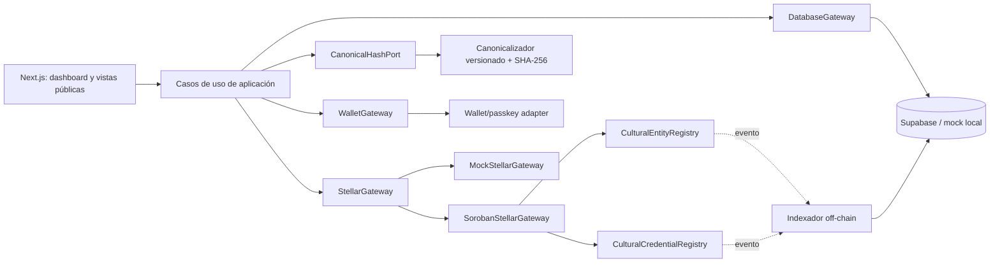

# Arquitectura de contratos Soroban para CulturaGO

## Decisión

> **CulturaGO necesita registros y atestaciones públicamente verificables; el producto actual no demuestra una necesidad funcional de un NFT estándar.**

El MVP emite acreditaciones vinculadas a un emisor, un sujeto y un evento, muestra estados de vigencia/revocación y expone una verificación pública por QR (`README.md:1-13`, `src/lib/db.ts:120-147`, `src/components/CredentialCard.tsx:42-130`, `src/app/credencial/[credentialCode]/page.tsx:81-195`). No existe evidencia de marketplace, transferencias, regalías, gobernanza/votación ni coleccionables.

Una credencial personal transferible sería semánticamente incorrecta: permitiría que otra cuenta aparentara ser su titular. Implementar `NonFungibleToken` y hacer que `transfer`/`approve` fallen siempre también sería incorrecto: rompería las expectativas de interoperabilidad del estándar y el principio de sustitución de Liskov. Un cliente que acepta un NFT estándar presupone que sus operaciones contractuales se comportan conforme a esa interfaz; un subtipo que rechaza incondicionalmente esas operaciones no es sustituible.

Por tanto, se diseñan **exactamente dos contratos**, sin un tercero:

1. **`CulturalEntityRegistry`**: registra, versiona y desactiva hashes de entidades culturales.
2. **`CulturalCredentialRegistry`**: emite, revoca y verifica credenciales únicas con `credential_id`/`token_id`, tratadas como **atestaciones no transferibles**, no como NFT estándar.

Stellar/Soroban aporta verificación pública porque el contrato, sus entradas persistentes, las autorizaciones y los eventos quedan sujetos al consenso de la red y pueden consultarse independientemente del backend. Esto permite comprobar que un hash fue registrado por una dirección autorizada y que una credencial no fue revocada. No prueba que los datos originales sean verdaderos: prueba quién atestó qué hash, en qué estado y en qué ledger.

## Límite on-chain/off-chain

| On-chain mínimo | Off-chain obligatorio |
|---|---|
| Identificadores opacos y acotados | Nombre legal/artístico y descripción completa |
| Hash canónico `BytesN<32>` y versión del esquema de hash | Correo, teléfono, dirección, biometría/passkey y consentimientos |
| Emisor/sujeto como identificadores o `Address` cuando corresponda | Documento canónico verificable y herramienta para recalcularlo |
| Estado activo/revocado/desactivado | Fotografías, QR, perfiles, relaciones y datos operacionales |
| Versión, ledger de creación/actualización/revocación | Estado de UX, errores RPC, intentos y detalles de soporte |
| Eventos sin datos personales | Índice consultable, auditoría ampliada y políticas de retención |

El hash no anonimiza datos de baja entropía: un atacante puede probar valores posibles. Nunca se deben publicar PII, secretos, credenciales WebAuthn, notas privadas, URLs con tokens ni hashes directos de campos sensibles sin un diseño de compromiso con sal y custodia apropiada. El repositorio ya separa datos personales en `Person`, `Organization` y `Provider` (`src/lib/db.ts:32-74`) y declara la intención de anclar solo `metadata_hash` (`docs/architecture.md:59-61`).

## Arquitectura: alta cohesión y bajo acoplamiento



Cada contrato posee una responsabilidad cohesiva y no llama al otro. La aplicación coordina ambos mediante puertos; la base de datos conserva proyecciones y estados de operación, pero no sustituye la fuente on-chain para una verificación pública.

## Control de acceso y autorización

Usar **OpenZeppelin Stellar Contracts para Rust**, módulo `AccessControl`; **OpenZeppelin Contracts para Solidity no aplica a Soroban**. Fijar versiones exactas y compatibles de `soroban-sdk`, `stellar-access` y demás crates, con procedencia revisada y una versión auditada/aceptada por el proyecto; no usar rangos flotantes ni asumir compatibilidad entre versiones.

Roles mínimos:

| Rol | Alcance |
|---|---|
| `ADMIN_ROLE` | Equivale al administrador superior de `AccessControl`; gestiona roles y transferencia administrativa, no operaciones cotidianas. |
| `REGISTRAR_ROLE` | Registra/versiona/desactiva entidades en `CulturalEntityRegistry`. |
| `ISSUER_ROLE` | Emite credenciales en `CulturalCredentialRegistry`. |
| `REVOKER_ROLE` | Revoca credenciales; puede ser el mismo conjunto de direcciones que `ISSUER_ROLE`, pero sigue siendo un permiso explícito para mínimo privilegio. |

Cada contrato tiene **un único `__constructor`**, invocable solo al desplegar, que valida direcciones, inicializa el admin superior y concede únicamente los roles iniciales necesarios. Toda mutación recibe un `operator: Address`, exige su rol y ejecuta `operator.require_auth()` (directamente o mediante una macro `only_role` que lo garantice). Las lecturas públicas no requieren autenticación.

La transferencia de administración debe ser de dos pasos con expiración en ledger: el admin actual propone al nuevo admin y este acepta antes de `live_until_ledger`. No se reemplaza por una asignación directa. Las concesiones/revocaciones de roles y transferencias emiten los eventos de `AccessControl`.

## Contrato 1: `CulturalEntityRegistry`

### Modelo y almacenamiento

```rust
#[contracttype]
struct EntityVersion {
    metadata_hash: BytesN<32>,
    hash_schema: u32,
    version: u32,
    registrar: Address,
    recorded_ledger: u32,
}

#[contracttype]
struct EntityHead {
    latest_version: u32,
    active: bool,
    updated_ledger: u32,
}

#[contracttype]
enum EntityKey {
    Head(BytesN<32>),
    Version(BytesN<32>, u32),
}
```

- `entity_id: BytesN<32>` es un identificador opaco derivado de un ID de dominio estable, con separación de dominio; no usar nombre, correo ni `slug` directamente.
- **Instance storage**: configuración global pequeña (`schema_version`, límites, estado de pausa si se aprueba) y datos de `AccessControl`, porque comparten ciclo de vida con la instancia.
- **Persistent storage**: `EntityKey::Head` y cada `EntityKey::Version`; cada entidad/versionado es independiente, no cabe en almacenamiento global acotado y debe poder restaurarse tras archivado.
- No usar `Temporary`: la caducidad no debe borrar evidencia histórica.

### Entradas conceptuales

```rust
fn __constructor(env: Env, admin: Address, registrar: Address, hash_schema: u32)
fn register_entity(env: Env, operator: Address, entity_id: BytesN<32>, metadata_hash: BytesN<32>, hash_schema: u32) -> Result<u32, ContractError>
fn version_entity(env: Env, operator: Address, entity_id: BytesN<32>, expected_version: u32, metadata_hash: BytesN<32>, hash_schema: u32) -> Result<u32, ContractError>
fn deactivate_entity(env: Env, operator: Address, entity_id: BytesN<32>, expected_version: u32, reason_hash: Option<BytesN<32>>) -> Result<(), ContractError>
fn get_entity(env: Env, entity_id: BytesN<32>) -> Option<EntityHead>
fn get_entity_version(env: Env, entity_id: BytesN<32>, version: u32) -> Option<EntityVersion>
fn verify_entity(env: Env, entity_id: BytesN<32>, version: u32, metadata_hash: BytesN<32>, hash_schema: u32) -> VerificationResult
```

### Invariantes e idempotencia

- `register_entity` crea solamente la versión `1`; un registro repetido con exactamente el mismo hash/esquema devuelve la versión existente sin escribir ni emitir un segundo evento. Con contenido distinto devuelve `AlreadyExists`.
- `version_entity` exige entidad activa y `expected_version == latest_version`; evita actualizaciones perdidas y crea una nueva entrada sin sobrescribir historial.
- Una versión es inmutable. `deactivate_entity` cambia solo la cabeza; no elimina versiones.
- Desactivar una entidad ya inactiva es éxito idempotente si coincide `expected_version`.
- No existe reactivación implícita. Si el negocio la necesita, debe diseñarse y auditarse explícitamente.

## Contrato 2: `CulturalCredentialRegistry`

### Modelo y almacenamiento

```rust
#[contracttype]
struct CredentialRecord {
    credential_id: BytesN<32>,
    token_id: u64,
    issuer_id: BytesN<32>,
    subject_id: BytesN<32>,
    event_id: BytesN<32>,
    credential_type: u32,
    metadata_hash: BytesN<32>,
    hash_schema: u32,
    issued_ledger: u32,
    revoked: bool,
    revoked_ledger: Option<u32>,
}

#[contracttype]
enum CredentialKey {
    ById(BytesN<32>),
    ByToken(u64),
}
```

`token_id` es solo un identificador numérico único y práctico para indexación; no implica propiedad tokenizada, saldo, transferencia, aprobación ni compatibilidad NFT. La verdad de identidad sigue siendo `credential_id`, emisor, sujeto, hash y estado.

- **Instance storage**: `next_token_id`, versión de esquema, límites, configuración y control de acceso.
- **Persistent storage**: registro por `credential_id` y mapeo `token_id -> credential_id`. Evitar duplicar el registro completo en ambos índices.
- Historial de revocación se conserva en el mismo registro; nunca se elimina la credencial ni su evento de emisión.

### Entradas conceptuales

```rust
fn __constructor(env: Env, admin: Address, issuer: Address, revoker: Address, hash_schema: u32)
fn issue_credential(env: Env, operator: Address, credential_id: BytesN<32>, subject_id: BytesN<32>, metadata_hash: BytesN<32>, hash_schema: u32) -> Result<u64, ContractError>
fn revoke_credential(env: Env, operator: Address, credential_id: BytesN<32>, reason_hash: Option<BytesN<32>>) -> Result<(), ContractError>
fn get_credential(env: Env, credential_id: BytesN<32>) -> Option<CredentialRecord>
fn get_credential_by_token_id(env: Env, token_id: u64) -> Option<CredentialRecord>
fn verify_credential(env: Env, credential_id: BytesN<32>, metadata_hash: BytesN<32>, hash_schema: u32) -> VerificationResult
```

### Invariantes e idempotencia

- `credential_id` y `token_id` son únicos; `next_token_id` crece de forma monotónica y controla overflow.
- El emisor almacenado es el `operator` autorizado o una identidad institucional vinculada de forma inequívoca; no se acepta un emisor arbitrario sin su autorización.
- La emisión repetida con los mismos campos devuelve el `token_id` original; con cualquier diferencia devuelve `AlreadyExists`.
- Revocar una credencial inexistente falla. Revocarla otra vez con la misma razón es éxito idempotente; una razón distinta devuelve `AlreadyRevoked`.
- Revocar no borra ni transfiere. `verify_credential` solo es válida si existe, coincide hash/esquema y `revoked == false`.
- No hay `owner`, `balance`, `approve`, `transfer`, `burn` ni URI pública de metadata.

## Eventos, errores y tiempo

Los eventos usan tópicos cortos y estables; los datos incluyen solo identificadores opacos, versiones, operadores y ledgers. No incluir PII ni documentos completos.

| Evento | Tópicos indexables | Datos mínimos |
|---|---|---|
| `EntityRegistered` | `entity_id`, `version` | `metadata_hash`, `hash_schema`, `registrar`, `recorded_ledger` |
| `EntityVersioned` | `entity_id`, `version` | `metadata_hash`, `hash_schema`, `registrar`, `recorded_ledger` |
| `EntityDeactivated` | `entity_id`, `version` | `operator`, `reason_hash`, `recorded_ledger` |
| `CredentialIssued` | `credential_id`, `token_id` | `issuer`, `subject_id`, `metadata_hash`, `hash_schema`, `issued_ledger` |
| `CredentialRevoked` | `credential_id`, `token_id` | `revoker`, `reason_hash`, `revoked_ledger` |

Cada mutación exitosa emite exactamente un evento de dominio; una repetición idempotente no lo vuelve a emitir. Los eventos fallidos se descartan junto con la invocación.

Errores tipados compartidos conceptualmente: `Unauthorized`, `InvalidInput`, `AlreadyExists`, `NotFound`, `Inactive`, `VersionConflict`, `AlreadyRevoked`, `UnsupportedHashSchema`, `LimitExceeded`, `TokenIdOverflow`. No usar `panic!` con texto como API de negocio.

Soroban ofrece número/secuencia de ledger como referencia determinista. Guardar `recorded_ledger`, `issued_ledger` y `revoked_ledger`; no tratar la hora de reloj del navegador como prueba on-chain. La proyección off-chain puede guardar el `closed_at` del ledger y la hora local para UX, identificándolos como metadatos derivados.

## Hash canónico, privacidad y límites

La implementación actual entrega las claves del objeto superior como lista global de reemplazo a `JSON.stringify` y cae a un hash aleatorio ante error (`src/lib/hashes.ts:5-30`); por ello puede omitir propiedades anidadas que no estén en esa lista, el fallback invalida la verificabilidad y la canonicalización no define tipos, Unicode ni campos ausentes.

Contrato de hash recomendado:

1. Definir un documento por tipo y una `hash_schema` explícita, por ejemplo `culturago.entity.v1` y `culturago.credential.v1`.
2. Aplicar JSON Canonicalization Scheme o una codificación binaria canónica documentada: UTF-8, normalización acordada, claves recursivamente ordenadas, números y `null` definidos, sin campos volátiles.
3. Aplicar separación de dominio: `SHA-256("CULTURAGO\0" || schema || "\0" || canonical_bytes)`.
4. Rechazar errores; nunca generar un valor aleatorio alternativo.
5. Publicar una herramienta local de verificación y vectores dorados compartidos entre TypeScript y Rust.

Límites iniciales: identificadores de longitud fija (`BytesN<32>`), hash fijo (`BytesN<32>`), `reason_hash` opcional y sin texto libre on-chain. Validar `hash_schema` contra un conjunto admitido. Verificar antes del despliegue los límites vigentes de entradas, claves, eventos y presupuesto de la red; mantener cada entrada muy por debajo del máximo y evitar vectores no acotados.

## TTL y archivado

Todo dato Soroban tiene TTL. La estrategia debe ser operativa, no una suposición de permanencia:

- Extender el TTL de **instance storage** en mutaciones administrativas y mediante mantenimiento programado antes del umbral.
- Extender el TTL de la entrada persistente leída/escrita cuando se emite, versiona, desactiva, revoca o verifica con una política explícita de costo.
- Mantener un indexador off-chain de eventos y claves activas para programar renovaciones.
- Aceptar que `Persistent` e `Instance` pueden archivarse y diseñar simulación/restauración antes de invocar; nunca interpretar “archivado” como “no existe”.
- No confiar en que un operador externo renovará TTL para preservar seguridad. La evidencia histórica debe permanecer recuperable y replicada por el indexador.

## Integración con `src/lib/stellar.ts` y estados

El modelo ya define `not_registered | pending | registered | failed` y transacciones (`src/lib/db.ts:7-10`, `src/lib/db.ts:139-147`). `StellarStatusBlock` calcula el hash, guarda `pending`, llama al mock y luego persiste éxito/fallo (`src/components/StellarStatusBlock.tsx:55-99`). El adaptador real debe conservar el flujo, pero distinguir envío de confirmación:

1. `not_registered`: no existe operación iniciada.
2. `pending`: transacción construida/enviada o pendiente de confirmación; guardar red, XDR/ID idempotente seguro, hash real cuando exista y último ledger observado.
3. `registered`: resultado confirmado en un ledger y lectura del contrato coincide con la intención.
4. `failed`: fallo terminal conocido; conservar código, fase e información segura para reintento.

No marcar `registered` por recibir un hash de envío. Simular, firmar, enviar, consultar confirmación y finalmente leer el estado contractual. Un timeout permanece `pending` hasta reconciliación; reenviar a ciegas puede duplicar una operación.

### Sustitución de Liskov en puertos/adaptadores

```ts
interface StellarGateway {
  registerEntity(command: RegisterEntityCommand): Promise<Submission>;
  issueCredential(command: IssueCredentialCommand): Promise<Submission>;
  revokeCredential(command: RevokeCredentialCommand): Promise<Submission>;
  getOperation(operationId: string): Promise<OperationState>;
  verifyCredential(query: VerifyCredentialQuery): Promise<Verification>;
}
```

`MockStellarGateway` y `SorobanStellarGateway` deben cumplir el mismo contrato observable:

- mismas precondiciones y validaciones;
- mismos estados `pending/confirmed/failed/unknown`, errores tipados e idempotency key;
- posibilidad configurable de rechazo, timeout, archivado/restauración y confirmación tardía;
- ninguna garantía más fuerte en el mock que en producción.

El módulo actual es 100 % simulado: genera hashes/direcciones aleatorios y todas las mutaciones retornan éxito; la verificación siempre devuelve `verified: true` (`src/lib/stellar.ts:1-147`). Por ello **no es un sustituto fiel** del adaptador real y viola Liskov a nivel conductual: consumidores probados contra él pueden depender de éxito inmediato, ausencia de fallos y confirmación inexistente. Debe mantenerse explícitamente como adaptador demo, nunca como evidencia de integración.

## Extensiones OpenZeppelin: no adoptar automáticamente

| Componente | Decisión actual |
|---|---|
| NFT `Base` | No usar: no hay caso de negocio tokenizable ni transferible. |
| `Consecutive` | No usar: optimiza mint masivo consecutivo de NFT; las credenciales requieren emisión autorizada e identidad única. |
| `Enumerable` | No usar: enumerar tokens on-chain añade almacenamiento/costo; el índice se obtiene de eventos off-chain. |
| `Burnable` | No usar: borrar semánticamente una credencial contradice la revocación con historial. |
| `Royalties` | No usar: no hay mercado ni pagos de regalías. |
| `Votes` | No usar: una credencial no otorga poder de gobernanza. |
| `Pausable` | No incluir por defecto. Puede justificarse solo para **mutaciones** de emergencia (`register/version/deactivate/issue/revoke`) si el análisis de riesgo operativo lo exige; las lecturas y verificaciones nunca se pausan. Definir rol, evento, runbook y salida de emergencia. |
| `Upgradeable` | No incluir por defecto. Solo con gobernanza aprobada, autorización fuerte, versión de esquema, compatibilidad de almacenamiento y migraciones/rollback probados. Cambiar WASM no ejecuta de nuevo el constructor. |

### Decisión condicional futura

Si el negocio aprueba en el futuro una **insignia coleccionable transferible** con propiedad y transferencias reales, se debe reevaluar la responsabilidad de credenciales y podría emplearse OpenZeppelin Stellar `NonFungible` **Base** en un diseño separado. No se propone implementarlo ahora ni convertir retroactivamente atestaciones personales en NFT.

## Plan de pruebas

### Unitarias Soroban

- Constructor único, roles iniciales, administración en dos pasos y expiración.
- `require_auth` y denegación por cada rol incorrecto.
- Registro/emisión, repetición idempotente y conflicto con payload distinto.
- Versionado optimista, desactivación y consulta histórica.
- Revocación conservando registro, razón y ledger; doble revocación.
- Límites, esquema de hash desconocido, overflow y errores tipados.
- Eventos exactos y ausencia de eventos si la invocación falla.
- Extensión de TTL según los umbrales definidos.

### Integración

- TypeScript -> RPC Testnet -> contrato -> confirmación -> lectura -> proyección DB.
- Simulación RPC que detecta entradas archivadas, incorpora la lista de restauración y completa la invocación sin confundir archivado con inexistencia.
- Firmas y roles reales, rechazo de cuenta no autorizada y transferencia admin.
- Vectores de hash iguales en TypeScript/Rust y herramienta de verificación.
- Reintento tras timeout sin duplicar entidad/credencial.
- Eventos indexados y reconciliación frente a pérdida/retención de RPC.
- Enlaces de explorador únicamente para red y hash reales.

### Propiedad/modelo

- Para cualquier secuencia de comandos, una versión histórica nunca cambia.
- Un `credential_id` corresponde como máximo a un `token_id` y viceversa.
- Una credencial revocada nunca vuelve a verificar como vigente.
- Repetir una operación con la misma clave idempotente no cambia el estado observable.
- Ninguna secuencia concede transferencia, aprobación, saldo o propiedad tokenizada.
- Pruebas diferenciales entre `MockStellarGateway` y `SorobanStellarGateway` para el mismo conjunto de estados y errores.

## Matriz de trazabilidad

| Requisito existente | Contrato/función propuesta | Evidencia del repositorio |
|---|---|---|
| Pasaportes para personas, organizaciones, proveedores y eventos | `CulturalEntityRegistry.register_entity/version_entity` | `README.md:1-13`; `src/lib/db.ts:7-30` |
| Hash determinístico como anclaje | Ambos registros aceptan `metadata_hash` + `hash_schema` | `README.md:32-35`; `docs/stellar-integration.md:7-15`; `src/lib/hashes.ts:1-30` |
| Estados Stellar de la aplicación | Adaptador y reconciliación de comandos | `src/lib/db.ts:7-10`; `src/components/StellarStatusBlock.tsx:55-99` |
| Registro/versionado de entidad sin exponer PII | `register_entity`, `version_entity`, `verify_entity` | `docs/architecture.md:54-61`; `src/lib/db.ts:32-74` |
| Emisión única vinculada a emisor y sujeto | `issue_credential` | `src/lib/db.ts:120-137`; `src/components/CredentialForm.tsx:79-117` |
| Verificación pública por código/QR | `get_credential`, `verify_credential` | `src/components/CredentialCard.tsx:93-130`; `src/app/credencial/[credentialCode]/page.tsx:132-195` |
| Revocación visible y con historial | `revoke_credential` sin eliminar registro | `src/app/dashboard/credenciales/page.tsx:49-54`; `src/app/credencial/[credentialCode]/page.tsx:81-114` |
| Wallet/passkey futura, no requisito de propiedad NFT | Autorización mediante `Address`; fuera de ambos registros | `docs/stellar-integration.md:132-137`; `src/app/p/[slug]/page.tsx:119-137` |
| Integración Soroban aún simulada | Puerto `StellarGateway` y adaptadores sustituibles | `docs/architecture.md:54-57`; `src/lib/stellar.ts:1-147` |
| Evitar jerga NFT en UX | Atestación no transferible, no NFT estándar | `README.md:80-83`; `docs/architecture.md:49-52` |

## Fuentes oficiales

- Stellar, [Authorization](https://developers.stellar.org/docs/learn/fundamentals/contract-development/authorization).
- Stellar, [Persisting Data](https://developers.stellar.org/docs/learn/fundamentals/contract-development/storage/persisting-data) y [State Archival](https://developers.stellar.org/docs/learn/fundamentals/contract-development/storage/state-archival).
- Stellar, [Choosing the Right Storage](https://developers.stellar.org/docs/build/guides/storage/choosing-the-right-storage).
- Stellar, [Contract Events](https://developers.stellar.org/docs/build/smart-contracts/example-contracts/events).
- Stellar, [Upgrading Contracts](https://developers.stellar.org/docs/build/guides/conventions/upgrading-contracts).
- OpenZeppelin Stellar Contracts, [Non-Fungible Token](https://docs.openzeppelin.com/stellar-contracts/tokens/non-fungible/non-fungible).
- OpenZeppelin Stellar Contracts, [Access Control](https://docs.openzeppelin.com/stellar-contracts/access/access-control).
- OpenZeppelin Stellar Contracts, [Pausable](https://docs.openzeppelin.com/stellar-contracts/utils/pausable).
- OpenZeppelin Stellar Contracts, [Upgradeable](https://docs.openzeppelin.com/stellar-contracts/utils/upgradeable).
